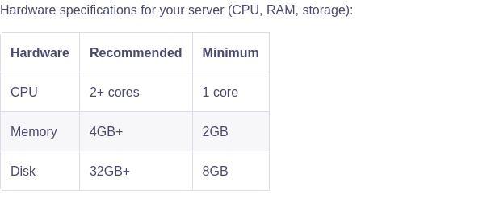

# Strapi Application with Docker and PM2

This repository contains a **Strapi** application configured to run in a **Docker** environment using **PM2** for process management. It includes a PostgreSQL database and pgAdmin for database management. This setup is ideal for development and production environments, ensuring consistency and scalability.

---

## Specs


## Tech Stack

- **Strapi**: `5.10.4`  A headless CMS for building APIs quickly.
- **Node.js**: `v18.18.0`
- **PostgreSQL**: `Latest` A powerful, open-source relational database.
- **pgAdmin**: `Latest` A web-based interface for managing PostgreSQL databases.
- **PM2**: `Latest` Process manager for Node.js applications, ensuring the app runs efficiently in development & production.
- **Docker & Docker Compose**: `Latest` Containerized environment for easy setup and deployment.

---

## Prerequisites


- **Docker**: [Install Docker](https://docs.docker.com/get-docker/)
- **Docker Compose**: [Install Docker Compose](https://docs.docker.com/compose/install/)
- **Git**: [Install Git](https://git-scm.com/downloads)


## Project Dependances


- **Pino**:[docs](https://www.npmjs.com/package/pino)
- **Strapi-health-plugin**:[docs](https://github.com/rkristelijn/strapi-health-plugin)
- **Strapi-plugin-remote-select**:[docs](https://market.strapi.io/plugins/strapi-plugin-remote-select)
- **Strapi-v5-plugin-populate-deep**:[docs](https://github.com/tooonuch/strapi-v5-plugin-populate-deep)

---

## Getting Started

### 1.  Configure Environment Variables

 - on docker-compose.yaml file
 - .env.example

### 2.  Build and Run the Docker Containers

```bash
docker-compose up
```

## License

This project is licensed under the MIT License.
